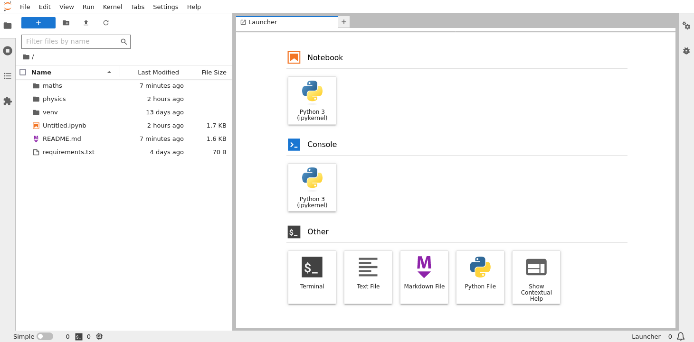
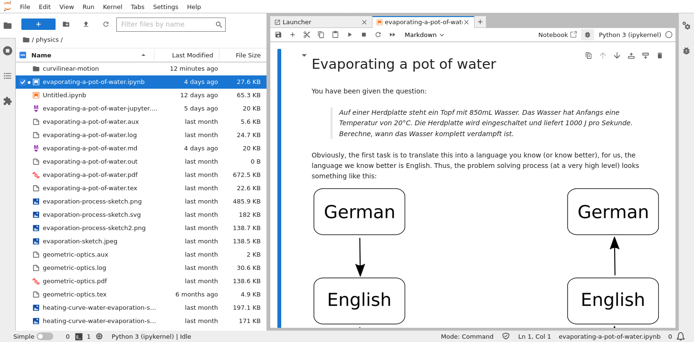

# After school help

Worked solutions to high-school science problems.

## Physics

  - [Evaporating a pot of water](physics/evaporating-a-pot-of-water.ipynb) [](https://mybinder.org/v2/gh/paultcochrane/after-school-help/HEAD?labpath=physics%2Fevaporating-a-pot-of-water.ipynb)

## Maths

  - [Throwing a javelin](maths/throwing-a-javelin.ipynb) [](https://mybinder.org/v2/gh/paultcochrane/after-school-help/HEAD?labpath=maths%2Fthrowing-a-javelin.ipynb)

## Running Jupyter notebooks on your own computer

It's not necessary to use the [JupyterLab](https://jupyter.org/) notebooks
linked above only through [Binder](https://mybinder.org/); you can also run
them on your own computer.  If you use Windows, you'll need to use [Windows
Subsystem for Linux
(WSL)](https://learn.microsoft.com/en-us/windows/wsl/about) for the
following instructions to work.  On [MacOS](https://www.apple.com/macos/) or
[Linux](https://www.linux.org/), just open a terminal and enter the commands
there.

First things first: clone the repository.  You'll need to use a command like
this:

```shell
git clone https://github.com/paultcochrane/after-school-help.git
```

That will create a directory named `after-school-help`; change into that
directory (via the `cd` command) and then install the
[Python](https://www.python.org/) requirements with the `pip` command.

```shell
cd after-school-help  # change into the directory we just created
python3 -m venv venv  # create the Python virtual environment
source venv/bin/activate  # activate the Python virtual environment
pip install -r requirements.txt  # install the required Python libraries
```

Now you'll be ready to start the JupyterLab notebook environment.  Just run

```shell
jupyter lab
```

and the JupyterLab environment will start with a launcher window similar to
that below:



To open a pre-existing notebook, just double click on one of the folders
(e.g. `physics` or `maths`) and double click on a notebook file (anything
with the  icon or any file
with the `.ipynb` extension.  For instance, if you open the [evaporating a
pot of water](physics/evaporating-a-pot-of-water.ipynb) worked example file,
you'll see something like this:



Now feel free to play around, change the numbers in the code and re-run the
individual notebook cells to see the effects of your changes!
