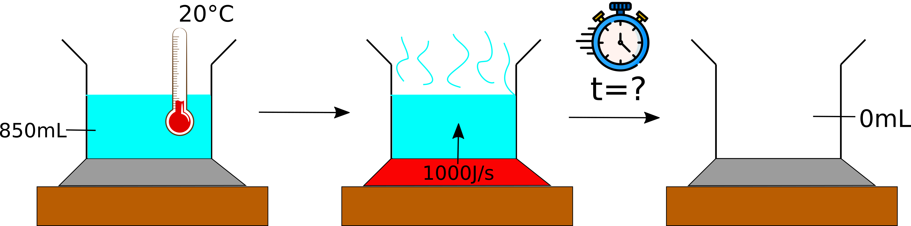
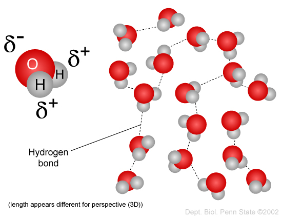
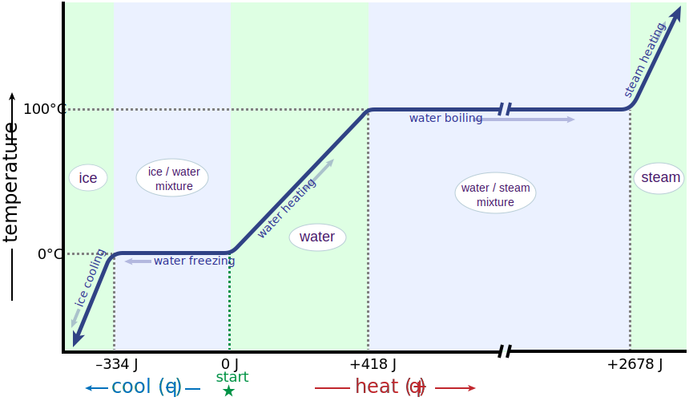

# Evaporating a pot of water

You have been given the question:

> Auf einer Herdplatte steht ein Topf mit 850mL Wasser.  Das Wasser hat
> Anfangs eine Temperatur von 20°C.  Die Herdplatte wird
> eingeschaltet und liefert 1000 J pro Sekunde.  Berechne, wann das Wasser
> komplett verdampft ist.

Obviously, the first task is to translate this into a language you know (or
know better), for us, the language we know better is English.  Thus, the
problem solving process (at a very high level) looks something like this:

Now that we have a rough path to follow, let's perform the first step:
translation into English:

> A pot containing 850mL of water is sitting on a stove element.
> Initially, the water has a temperature of 20°C.  The element is
> turned on and delivers 1000 J per second.  Calculate when the water is
> completely evaporated.

The rest of this document is is going to be a "deep dive" into the question,
so buckle up!

## Translation notes

Let's pull the translation apart a bit.

Herdplatte is basically two words Herd (stove) and Platte (plate), where in
English the "plate" is called an "element" or "hob" and if it's a gas stove
then it's probably called a "burner".  An equivalent word in German to
'Herdplatte' is 'Kochfeld' which translates literally to "cook-field" and
would often be used to refer to one of the individual "fields" on electric
ceramic cooktops (another word for stove in English).

Anfangs basically means "initially" or "in the beginning" and is related to
the noun "Anfang" which means "beginning".

The past participle "eingeschaltet" literally means "on-switched" and hence
means that the stovetop element has been turned on.  Note that
"angeschaltet" and "eingeschaltet" mean almost exactly the same thing (if
you want to get a German confused, ask them for the difference; they'll
usually be stumped for an answer).  Both of these words mean "on-switched"
("ein" and "an" are often used interchangeably where one would use the word
"on" in English, especially in the sense of turning something on).

The word "liefert" (from the verb "liefern") means "delivers" and in the
sense meant here is that the stovetop element is delivering/providing/giving
energy to the pot.

"Berechne" is in the imperative mode (meaning this is a command) and means
simply "calculate".

The past participle "verdampft" is related to the noun "Dampf" which means
"steam" (i.e. water in the gaseous state) and means that the water has
completely turned into steam, which in English means "evaporated".  Note
that the English word contains the noun "vapour" (confusingly British
English spells "vapour" with a "u" but "evaporated" *without* a "u"; in this
case American English is more consistent and spells it "vapor") which means
"steam" or "gaseous water".

Now we can pull apart the question and see if we can solve the problem.

## Finding useful information in the question

Problem solving tip: extract the essential information from the question to
reduce the problem to its "bare bones".  Also note information about the
problem's context that might be relevant to solving the problem.  This is
something that takes practice and patience!

One strategy to solve a problem like the one we have is to read the entire
question first before doing anything else to get a high-level overview of
what's being asked.  Then we return to the beginning and take each sentence
one at a time and pull out the information that might be useful to us and
maybe categorise it somehow.  For instance, in the first sentence

> A pot containing 850mL of water is sitting on a stove element.

the main piece of information is that we have 850mL of water which will be
heated up.  The fact that it's in a pot on a stove is only secondary; it
could be in a glass flask on a heating element or could be in a plastic bowl
in a microwave oven, what's important is that we have a certain amount of
water and energy is going to be fed into it to heat it up.

> Initially, the water has a temperature of 20°C.

The water is at 20°C before anything else happens to it.  This is also a
hint that the temperature is going to change somehow and that we've been
given a reference temperature for later calculations.

> The element is turned on and delivers 1000 J per second.

Fairly obviously, 1000 J of energy is being added to the water per second.
This is the bit where we realise that it's being heated up, but this tells
us exactly how: 1000 J for every second (which, incidentally, is 1000 W; a
[Watt](https://en.wikipedia.org/wiki/Watt) is the amount of energy per unit
time, in particular the number of Joules per second).  We know from reading
the whole question at the beginning that we have to calculate a time, so
having time (i.e. seconds) turn up in one piece of information is very
helpful to keep in the back of our heads for the remainder of the question.

> Calculate when the water is completely evaporated.

The important words in this sentence are "when" and "evaporated".  We've
thus been asked for an amount of time ("when"; which probably could be more
precisely specified as "how many seconds are required to completely
evaporate the water" or "how much time will pass before all of the water has
evaporated").  An amount of time links back to the energy rate we have from
the previous sentence (1000 J/s is an energy *rate*: it is how much energy
per unit time is being added to the system).  The second important word
"evaporated" tells us the final state of the system, i.e. all of the
*liquid* water has been turned into *gaseous* water (steam) and is thus
"gone" into the air.

Using the words from the question, task we've been asked to perform is thus
reduced to:

> 850mL water, 20°C; 1000 J/s; when evaporated?

Another way to write the same thing (Tip: rewording the same question in
different ways gives a new perspective and sometimes brings insight into how
to solve a given question) would be something like this, where we make time
more explicit:

  - t<=0: 850mL water at 20°C
  - t=0: 1000 J/s
  - t=? when water volume is 0mL?

We could also look at this pictorially:

We have a rate of energy per unit time, thus if we know how much energy we
need to completely evaporate the water, then we can work out how much time
that will take (the energy rate is constant, which also makes things easier
to calculate).

## A physical intuition of the overall evaporation process

So how do we get from water at 20°C to all of it being completely
evaporated?  This is a two-step process:

  - heat up the water to 100°C
  - convert the liquid water into gaseous water (steam)

Note that there's a simplifying assumption being used here: evaporation
doesn't occur until the water has reached 100°C.  We know from experience
that water doesn't have to be boiling in order for it to evaporate, however
in this case that process is *much slower* than how quickly the water is
being heated by the stove element, thus we ignore any evaporation which
might be happening as the water is heated from 20°C to 100°C.

That might sound a bit weird.  After all, isn't water at 100°C boiling?  And
thus it's already turning into steam?  This is true to a degree, however
when water is boiling at 100°C it is actually a mixture of liquid and
gaseous water[^states-of-matter], both states being at 100°C.  When water is
a gas, the water molecules have so much energy that they don't really
interact with one another.  The situation is very different in the liquid
state: water molecules are held together by their intermolecular force,
which is mostly due to [hydrogen
bonding](https://en.wikipedia.org/wiki/Water#Hydrogen_bonding) but also
partially due to the [van der Waals
force](https://en.wikipedia.org/wiki/Van_der_Waals_force).

These bonds look something like this:

In order for liquid water to become a gas, these forces have to be overcome
and that takes energy.  Thus, we need two lots of energy to evaporate water:
heat it up to boiling point and then break the intermolecular bonds.

[^states-of-matter]: Note that the [solid, liquid and gaseous states](https://en.wikipedia.org/wiki/State_of_matter) are also called "phases", thus one can talk about when water is in the "gaseous phase" or equivalently the "gaseous state".

These two steps are governed by two pieces of
[thermodynamics](https://en.wikipedia.org/wiki/Thermodynamics): the
[specific heat
capacity](https://en.wikipedia.org/wiki/Specific_heat_capacity) and the
[heat of
vaporisation](https://en.wikipedia.org/wiki/Enthalpy_of_vaporization)[^heat-of-vaporisation].

[^heat-of-vaporisation]: The heat of vaporisation is also called the [enthalpy of vaporisation](https://en.wikipedia.org/wiki/Enthalpy_of_vaporization), the latent heat of vaporisation, or the heat of evaporation.

The specific heat capacity is the amount of energy (per unit mass) that it
takes to raise a substance by 1°C.  You will often see this written with
units of $\mathrm{J \cdot kg^{-1} \cdot K^{-1}}$, where a temperature change
of 1 K is the same as a temperature change of 1°C.  Thus, the specific heat
is what we can use to work out how much energy it will take to heat the
water up from 20°C to 100°C.

The heat of vaporisation is the amount of energy per unit mass required to
change from the liquid into the gaseous state.  This is sometimes quoted in
units of J/g or kJ/kg, which is the same thing.

Unfortunately, the values for these parameters are not given in the question
and hence we have to look them up and make some assumptions about which
values are expected to be used (there is sometimes variation in which value
one could use).  This isn't a problem because this is a much better
reflection of how the real world works: if one doesn't know what a certain
parameter is, then one has to go looking for it and work out if the numbers
one finds make sense in the given context.  This is actually a really good
situation because we've got a great opportunity to learn new things!

So what is the specific heat capacity for water?  To find this out we can
look up the value in a [table of specific heat
capacities](https://en.wikipedia.org/wiki/Table_of_specific_heat_capacities)
and for water at 25°C (close enough for our purposes) the value is 4.1813
$\mathrm{J \cdot kg^{-1} \cdot K^{-1}}$.

And what about the heat of vaporisation?  After a bit of looking around, we
find a [table on the Enthalpy of vaporisation Wikipedia
page](https://en.wikipedia.org/wiki/Enthalpy_of_vaporization#Other_common_substances)
which lists values for common substances, one of which is water.

Note the comment on [that same Wikipedia
page](https://en.wikipedia.org/wiki/Enthalpy_of_vaporization):

> The enthalpy of vaporization is often quoted for the normal boiling
> temperature of the substance.

The fact that the enthalpy of vaporisation is specified with respect to the
normal boiling point backs up our intuition that the evaporation process is
split into two parts: heating to the boiling point and then vaporising.
Thus we can be more confident that we're on the right path.

## Building a physical intuition from experiment

But you don't have to take my word for it, you can conduct an experiment to
try it out.  The experiment is described on the [heating curves
page](https://gchem.cm.utexas.edu/thermo/index.php#enthalpy/heat-curves.html)
of the [University of Texas Chemistry 301 thermodynamics
course](https://gchem.cm.utexas.edu/thermo/index.php) and the setup is
similar to the problem we're trying to solve: take a beaker with ice in it
and put it on a hot plate (another word for "Herdplatte"; there's lots of
redundancy in language) at a temperature well above 100°C (in this case
120°C).  Through experience, we know that the ice will melt into water and
as we add more heat to the water it will eventually boil.  It's important
that the temperature of the hot plate is above the boiling point of water so
that we know that the hot plate is always adding energy to the water.  If we
measure the temperature of the water as we add more energy to the system
(i.e. the water), then we'll see that the temperature will rise until we
have an ice-water solution, at which point the temperature will stay
constant at 0°C until all of the ice has melted.  Once all the ice has
melted, the water's temperature will start rising again and at a rate
proportional to the amount of energy we add to it per unit time.  The
temperature will keep rising until the water starts to boil and we have a
water-steam mixture at a temperature of 100°C.  The water-steam mixture will
stay at this temperature until all of the water has evaporated into steam
and then the temperature of the steam will continue rising in proportion to
the amount of energy we're adding to the system per unit time.  If we plot
the temperature of the system against the energy we add to the system, we
get a [heating
curve](https://chem.libretexts.org/Bookshelves/General_Chemistry/Map%3A_A_Molecular_Approach_(Tro)/11%3A_Liquids_Solids_and_Intermolecular_Forces/11.07%3A_Heating_Curve_for_Water)

There's an interesting point to make here: if we know we are adding energy
to the system at a constant rate (as we are in the problem we're trying to
solve), then an x-axis of energy (Joules as in the graph above) is
*equivalent* to an x-axis of *time* because time is directly related to
energy through the energy rate (1000 J/s in the problem we want to solve).
Thus the graph above could also be read as temperature changes over time.

This helps us better understand the problem we want to solve because we just
need to work out what point on the x-axis matches 20°C and then work out how
much energy is required to get to the plateau at 100°C and then we just need
to work out the energy required to convert the water-steam mixture at 100°C
into all steam (i.e. all of the water has evaporated).

Thus the problem we want to solve is a subset of the heating curve for water
that we are now familiar with:

## Calculating how long it takes for the water to evaporate

Let's scale down the problem to consider heating up only 1mL of water from
20°C to 100°C (because 1mL is easier to think about than 850mL).

### Heating up the liquid water

The [specific heat
capacity](https://en.wikipedia.org/wiki/Specific_heat_capacity) of liquid
[water](https://en.wikipedia.org/wiki/Water) is 4184 J/kg/K and is sometimes
quoted more approximately by 4.2 kJ/kg/K (where we use kJ to scale down the
numerical value by a factor of 1000 (this just makes the numbers easier to
work with)) or equivalently 4.2 J/g/K (because the "kilo" part in kJ and kg
effectively cancel when dividing).

Thus, the energy to raise 1g of water from 20°C to 100°C is (let's call this
the heating energy $E_h = E_1 - E_0$; see also the heating curve diagram
above):

$$
\begin{equation}
E_h(1\mathrm{g}) = 4.2 \mathrm{J/g/K} \cdot (100 - 20) \mathrm{K} = 336 \mathrm{J}
\end{equation}
$$

However, we have a *volume* of water not a *weight*, thus we need to work
out how many grams there are in 1mL of water.  Water has a density of
0.9970474 g/mL at 25 °C, therefore:

$$
\begin{equation}
1\mathrm{mL\ of\ water} = 0.9970474\mathrm{g\ of\ water}
\end{equation}
$$

For our purposes, this is close enough to the value 1, so we can assume that
1mL of water weighs 1g.  With this simplification in mind, we can say that
the energy required to raise 1mL of water from 20°C to 100°C (i.e. 80°C) is:

$$
\begin{equation}
E_h(1\mathrm{mL}) = 4.2 \mathrm{J/g/K} \cdot (100 - 20) \mathrm{K} = 336 \mathrm{J}
\end{equation}
$$

Thus, to raise 850mL of water by 80°C (equivalently by 80K) is:

$$
\begin{equation}
E_h = 850 \mathrm{g} \cdot 4.2 \mathrm{J/g/K} \cdot (100 - 20) \mathrm{K} = 285600 \mathrm{J}
\end{equation}
$$

### Turning boiling liquid water into steam

The [heat of vaporisation for
water](https://en.wikipedia.org/wiki/Enthalpy_of_vaporization#Other_common_substances)
is given as 2257 J/g or [2265 kJ/kg = 2265
J/g](https://en.wikipedia.org/wiki/Latent_heat#Table_of_specific_latent_heats)
or [2260
kJ/kg](https://link.springer.com/referenceworkentry/10.1007/978-90-481-2642-2_327)
depending upon where one looks.  This is why it would have been helpful to
have the expected values to use as part of the question.  I don't think the
exact value matters that much really, so we'll just use the value from the
[heat of vaporisation for water Wikipedia
page](https://en.wikipedia.org/wiki/Enthalpy_of_vaporization#Other_common_substances),
i.e. 2257 J/g.

We have 850mL of water = 850 g of water at 100°C.  Thus the amount of energy
to evaporate this amount of water is (let's call this energy amount $E_v$;
the energy of vaporisation):

$$
\begin{equation}
E_v = 2257 \mathrm{J/g} \cdot 850 \mathrm{g} = 1918450 \mathrm{J}
\end{equation}
$$

### Total energy and total time to evaporate water

The total energy we require to evaporate all of the water, $E_{tot}$ is thus

$$
\begin{equation}
E_{tot} = E_h + E_v = 285600 \mathrm{J} + 1918450 \mathrm{J} = 2204050 \mathrm{J}
\end{equation}
$$

Since we know that we're adding energy to the system at a rate of 1000 J/s,
it will thus take $E_{tot}/1000$ s to evaporate all of the water.  I.e. the
time to evaporate all of the water, $t_e$ is:

$$
\begin{align}
t_e &=& 2204050 / 1000 \mathrm{s}\\
    &=& 2204.05 \mathrm{s}\\
    &=& 2204.05 / 60 \mathrm{\ minutes}\\
    &=& 36.73 \mathrm{\ minutes}
\end{align}
$$

In other words, it will take just over half an hour to evaporate all of the
water, which seems about right from previous experience of boiling water on
a stove.

## Returning to where we came from

Now that we've solved the problem and formulated the solution to that
problem in English, the final step is to translate our calculation into
German.  We've got a few new words we'll need to use.  Two cases in point:

  - The specific heat capacity is "spezifische Wärmekapazität" in German
    (note that the concept of "heat" in English is translated to "Wärme" in
    German and is related to the word "warmth" in English).
  - The heat of vaporisation is "Verdampfungswärme" in German.  The word
    "Dampf" means "steam" in German and "Verdampfung" is thus process of
    turning something into steam (i.e. evaporating it).

Let's try and describe the situation simply in English like so:

> To evaporate all of the water, we need to first get the water boiling and
> then vaporise the water.  Given the heat capacity of water of 4.2 J/g/K,
> the temperature difference of 80K and the mass of water (850mL = 850g), it
> will take $850\mathrm{g} \cdot 4.2 \mathrm{J/g/K} \cdot 80 \mathrm{K} =
> 285600\mathrm{J}$ to boil the water.  Given the heat of vaporisation of
> $2257 \mathrm{J/g}$ it will take $850\mathrm{g} \cdot 2257 \mathrm{J/g} =
> 1918450\mathrm{J}$ to vaporise the water.  The total energy required is
> thus $285600 \mathrm{J} + 1918450 \mathrm{J} = 2204050\mathrm{J}$.  At a
> constant rate of 1000 J/s this will take $2204050 \mathrm{J} / 1000
> \mathrm{J/s} = 2204.05\mathrm{s}$ (approximately half an hour) to
> evaporate all of the water.

This we could render into German as follows:

> Damit das gesamte Wasser verdampft, muss man zuerst das Wasser zum Kochen
> bringen und dann das Wasser in Dampf umwandeln.  Da die Wärmekapazität 4.2
> J/g/K, die Temperaturdifferenz 80 K und Masse des Wassers 850g (=850mL)
> betragen, ist die Energiemenge, um das Wasser zum Kochen zu bringen $850
> \mathrm{g} \cdot 4.2 \mathrm{J/g/K} \cdot 80 \mathrm{K} =
> 285600\mathrm{J}$.  Da die Verdampfungswärme für Wasser 2257 J/g lautet,
> wird eine Energiemenge von $850\mathrm{g} \cdot 2257 \mathrm{J/g}=
> 1918450\mathrm{J}$ gebraucht, um das Wasser in Dampf umzuwandeln.  Die
> gesamte Energiemenge ist deshalb $285600 \mathrm{J} + 1918450 \mathrm{J} =
> 2204050\mathrm{J}$.  Da 1000 J/s von der Herdplatte dem Wasser zugeführt
> werden, dauert es $2204050 \mathrm{J} / 1000 \mathrm{J/s} =
> 2204.05\mathrm{s}$ (ungefähr eine halbe Stunde), um das Wasser vollständig
> zu verdampfen.

And that's it!
